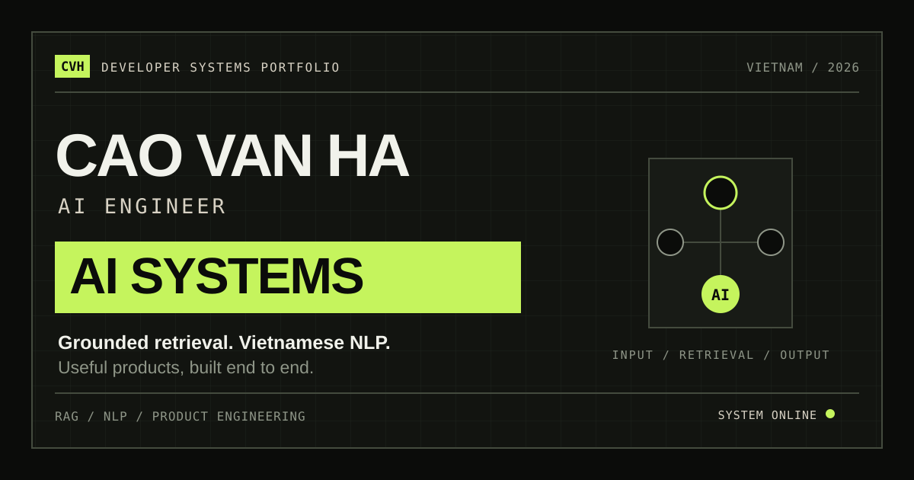

<div align="center">

A responsive, editorial portfolio presenting my work in retrieval-augmented generation, Vietnamese NLP, educational technology, and full-stack AI product development.



## Overview

This portfolio turns each project into a compact technical case study. Large editorial layouts introduce the problem and outcome, while data-driven system diagrams explain how information moves through each product.

The site is intentionally built as a focused single-page experience. It combines clear project storytelling with accessible navigation, restrained motion, responsive layouts, and direct contact options.

## Highlights

- Editorial Hero with an animated applied-AI system map.
- Four project case studies generated from structured project data.
- Technical pipeline visuals for retrieval, NLP, and computer vision workflows.
- Active section navigation with smooth anchor scrolling.
- Responsive layouts for desktop, tablet, and mobile screens.
- Keyboard navigation, visible focus states, skip navigation, and reduced-motion support.
- Client-side contact form validation with accessible status messages.
- Open Graph and Twitter metadata for social sharing.

## Selected Work

| Project | Area | Core stack | Repository |
| --- | --- | --- | --- |
| IT Smart Assistant | Education and RAG | RAG architecture, AI chatbot, backend development | [GitHub](https://github.com/CaoRIV/IT-Smart-Assistant) |
| MathRAG THPT | Learning and retrieval | FastAPI, React, BM25, FAISS, Ollama | [GitHub](https://github.com/CaoRIV/MathRAG-THPT) |
| V-Fashion Insight | Vietnamese NLP | Python, TF-IDF, PhoBERT, Hugging Face | [GitHub](https://github.com/CaoRIV/V-Fashion-Insight) |
| AnimalDex | Computer vision | Next.js, FastAPI, TensorFlow/Keras, Supabase | [GitHub](https://github.com/CaoRIV/animal-dex) |

## Page Structure

1. **Hero** - Positioning, availability, calls to action, and the animated system map.
2. **Current Practice** - RAG architecture, Vietnamese NLP, AI product engineering, and full-stack delivery.
3. **Selected Work** - Alternating technical case-study bands for the four featured projects.
4. **Process** - Discover, Design, Build, and Validate.
5. **Capabilities** - AI and data, product engineering, and infrastructure skills.
6. **Experience** - Learning, research, and current technical focus.
7. **Contact** - Email, social links, and an accessible inquiry form.

## Tech Stack

- **React 19** for component structure and data-driven rendering.
- **Vite 6** for local development and production builds.
- **Framer Motion 12** for entrance reveals and restrained looping motion.
- **Plain CSS** for the design system, layouts, and responsive behavior.
- **Playwright Core** for responsive visual and interaction checks.

## Getting Started

### Prerequisites

- Node.js
- pnpm
- Google Chrome, required by the visual-check script

### Install

```bash
pnpm install
```

### Start Development

```bash
pnpm dev
```

The development server runs at [http://127.0.0.1:5173](http://127.0.0.1:5173) by default.

### Create A Production Build

```bash
pnpm build
```

Vite writes the production output to `dist/`.

### Preview The Production Build

```bash
pnpm preview
```

## Available Scripts

| Command | Purpose |
| --- | --- |
| `pnpm dev` | Start the Vite development server on `127.0.0.1`. |
| `pnpm build` | Generate the optimized production bundle. |
| `pnpm preview` | Serve the production bundle locally. |
| `node scripts/visual-check.mjs` | Run responsive visual and interaction checks. |

## Visual Verification

Run the complete browser smoke test with:

```bash
node scripts/visual-check.mjs
```

The script checks the site at `1440x1000`, `1024x900`, and `390x844`. It verifies:

- Required sections and project counts.
- Browser console and page errors.
- Horizontal overflow and out-of-viewport elements.
- Hero animation and desktop project hover feedback.
- Scroll reveal visibility.
- Empty, invalid-email, and valid contact form states.

Generated screenshots are stored in the ignored `test-results/` directory.

## Project Structure

```text
Personal_Portfolio/
|-- public/
|   `-- og-preview.svg
|-- scripts/
|   `-- visual-check.mjs
|-- src/
|   |-- main.jsx
|   `-- styles.css
|-- index.html
|-- package.json
|-- pnpm-lock.yaml
`-- pnpm-workspace.yaml
```

## Content And Customization

Portfolio content is stored in the `profile` object near the top of `src/main.jsx`. Personal details, practice areas, projects, process steps, skills, experience entries, and social links can be updated there without changing the section components.

Global colors, typography, spacing, component states, and responsive breakpoints are defined in `src/styles.css`.

## Contact Form Note

The contact form currently validates input and displays accessible feedback in the browser. It does not send data to an email service or backend endpoint. Direct contact remains available through the email and social links shown on the site.

## Author

**Cao Van Ha**

AI Engineer based in Vietnam

[GitHub](https://github.com/CaoRIV) | [X](https://x.com/Cao744604355049) | [Email](mailto:caov77029@gmail.com)
  
<h1 align="center">Cao Van Ha Portfolio</h1>
<p align="center">A premium one-page showcase for AI engineering work and product thinking.</p>

<p align="center">
  
  
  
  
  
</p>

<p align="center">
  
  
  
  
</p>

## Product Description

This portfolio presents Cao Van Ha’s work as an AI Engineer across RAG systems, Vietnamese NLP, and education-focused products. It combines clean storytelling, selected case studies, and motion-driven UI to communicate both technical depth and product execution
